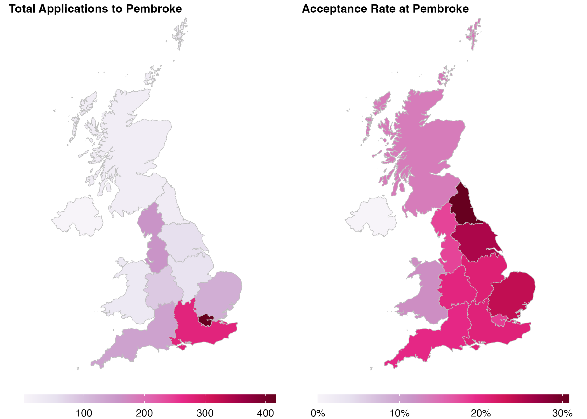

Visualizations, tables, and links to standalone data dashboards (such as [this one](https://rpubs.com/saurabh90/school-dashboard)) will be added here.

----

&nbsp;

Figure 1: Region-wise total applications to (figure on the left) and acceptance rate (figure on the right) at Pembroke College from 2019-21

 

<!-- pages/data.md -->


  <!-- Display categorized dashboards -->
  
  <h2 class="category">{{ category }}</h2>
  
  
  <!-- Generate cards for each project -->
  
  

    

    
      
    
    

  

  
  

    
      
    
  

  
  


<!-- Display dashboards without categories -->
  
  <!-- Generate cards for each project -->
  
  

    

    
      
    
    

  

  
  

    
      
    
  

  


